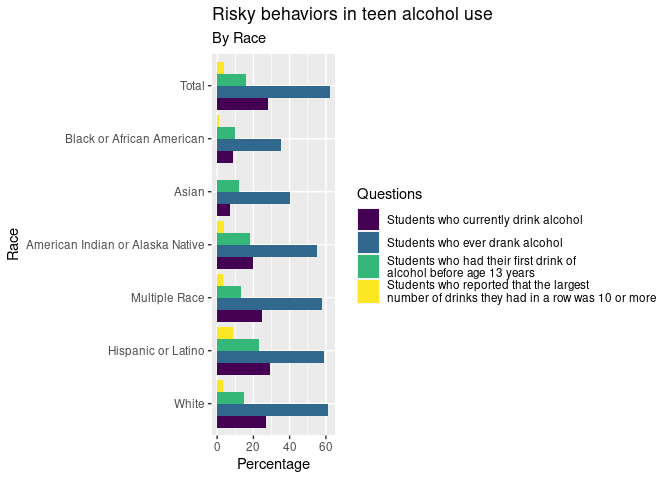
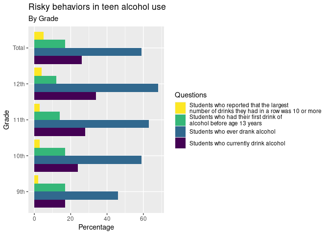
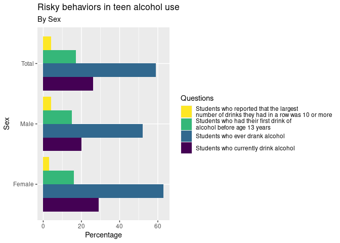

Project proposal
================
Ella and Leo

``` r
library(tidyverse)
library(broom)
library(readr)
```

## 1. Introduction

For our project we are working with a data set called “Youth Risk
Behavior Surveillance System,” collected by the CDC. This data set looks
at demographics, environments, and behaviors in teenagers from 9-12th
grade across the country. According to the CDC the intent of this data
is to “determine how often unhealthy behaviors occur,assess whether
unhealthy behaviors increase, decrease, or stay the same over
time,provide data at the national, state, territorial and freely
associated state, tribal, and local levels, and provide data comparing
different groups of adolescents. The data is collected through surveys
given to students at both public and private high schools across the US.

Due to the size of the data we are looking at data from Maine only in
the years 2015 and 2017. The behaviors (variables) we will be looking at
specifically are:

\[1\] “Behaviors that Contribute to Unintentional Injuries” \[2\]
“Behaviors that Contribute to Violence”  
\[4\] “Cigarette Use”  
\[5\] “Other Tobacco Use”  
\[6\] “Alcohol Use”  
\[7\] “Other Drug Use”  
\[8\] “Sexual Behaviors”  
\[9\] “Physical Activity”

There are several questions we are interested in exploring through this
data:

1.  What is the relationship between tobacco use and physical activity?
2.  Are certain demographics of students more likely to engage in risky
    behaviors?
3.  How does age of initiation of use of a specific substance correlate
    with current use of that substance?
4.  Are students who use tobacco more likely to use alcohol or
    marijuana?

## 2. Data

``` r
youth_risk <- read_csv("../data/DASH_-_Youth_Risk_Behavior_Surveillance_System__YRBSS___High_School____Including_Sexual_Orientation_20240207.csv")
```

    ## Rows: 188760 Columns: 41
    ## ── Column specification ────────────────────────────────────────────────────────
    ## Delimiter: ","
    ## chr (27): LocationAbbr, LocationDesc, DataSource, Topic, Subtopic, ShortQues...
    ## dbl (10): YEAR, Greater_Risk_Data_Value, Greater_Risk_Low_Confidence_Limit, ...
    ## lgl  (4): Greater_Risk_Data_Value_Footnote_Symbol, Greater_Risk_Data_Value_F...
    ## 
    ## ℹ Use `spec()` to retrieve the full column specification for this data.
    ## ℹ Specify the column types or set `show_col_types = FALSE` to quiet this message.

``` r
# View(youth_risk)
```

``` r
new_youth_risk_df <- youth_risk %>% 
  select("YEAR", "Topic", "Subtopic", "ShortQuestionText", "Greater_Risk_Data_Value", "Lesser_Risk_Data_Value", "Sample_Size", "Sex", "Race", "Grade", "SexualIdentity", "SexOfSexualContacts") %>%
  filter(YEAR == 2017)
```

``` r
glimpse(new_youth_risk_df)
```

    ## Rows: 100,320
    ## Columns: 12
    ## $ YEAR                    <dbl> 2017, 2017, 2017, 2017, 2017, 2017, 2017, 2017…
    ## $ Topic                   <chr> "Unintentional Injuries and Violence", "Uninte…
    ## $ Subtopic                <chr> "Behaviors that Contribute to Unintentional In…
    ## $ ShortQuestionText       <chr> "Drinking and driving", "Drinking and driving"…
    ## $ Greater_Risk_Data_Value <dbl> 4.2920, 5.4859, 10.3536, 10.4129, 10.3849, 0.6…
    ## $ Lesser_Risk_Data_Value  <dbl> 95.7080, 94.5141, 89.6464, 89.5871, 89.6151, 9…
    ## $ Sample_Size             <dbl> 5138, 2469, 193, 230, 423, 1824, 4451, 137, 34…
    ## $ Sex                     <chr> "Total", "Total", "Total", "Total", "Total", "…
    ## $ Race                    <chr> "Total", "Total", "Total", "Total", "Total", "…
    ## $ Grade                   <chr> "Total", "Total", "Total", "Total", "Total", "…
    ## $ SexualIdentity          <chr> "Total", "Total", "Total", "Total", "Total", "…
    ## $ SexOfSexualContacts     <chr> "Total", "Opposite sex only", "Same sex only",…

``` r
Alc_Race_data_frame <- new_youth_risk_df %>%
  filter(ShortQuestionText %in% c("Initiation of alcohol use", "Ever alcohol use", "Current alcohol use", "Largest number of drinks")) %>%
  group_by(ShortQuestionText, Race) %>%
  summarise(Greater_Risk_Data_Value = round(mean(Greater_Risk_Data_Value, na.rm =TRUE), digits = 0)) %>%
   arrange(desc(Greater_Risk_Data_Value))
```

    ## `summarise()` has grouped output by 'ShortQuestionText'. You can override using
    ## the `.groups` argument.

``` r
 Alc_Race_data_frame <- Alc_Race_data_frame %>%
 pivot_longer(
    ends_with("Risk_Data_Value"), 
    names_to = "Risk_Data", 
    values_to = "Risk_Percent")  
```

``` r
Alc_Race_data_frame$Race <-  fct_relevel(Alc_Race_data_frame$Race, c("White", "Hispanic or Latino", "Multiple Race", "American Indian or Alaska Native", "Asian", "Black or African American", "Total"))

Alc_Race_data_frame %>% 
  filter(Race != "Native Hawaiian or Other Pacific Islander") %>%
  #mutate(Race = fct_relevel(Race, "White")) %>%
ggplot(aes(y= Race, x = Risk_Percent, fill = ShortQuestionText)) +
   geom_col(position="dodge", stat="identity") +
labs(y = "Race", x = "Percentage",
    title = "Risky behaviors in teen alcohol use",
    subtitle = "By Race",
    fill = "Severity") +
  scale_fill_viridis_d(name="Questions",
                    breaks=c("Current alcohol use", "Ever alcohol use", "Initiation of alcohol use", "Largest number of drinks"),
                     labels = c("Students who currently drink alcohol", "Students who ever drank alcohol", "Students who had their first drink of \nalcohol before age 13 years", "Students who reported that the largest \nnumber of drinks they had in a row was 10 or more" ))
```

    ## Warning in geom_col(position = "dodge", stat = "identity"): Ignoring unknown
    ## parameters: `stat`

<!-- -->

``` r
Alc_Grade_data_frame <- new_youth_risk_df %>%
  filter(ShortQuestionText %in% c("Initiation of alcohol use", "Ever alcohol use", "Current alcohol use", "Largest number of drinks")) %>%
  group_by(ShortQuestionText, Grade) %>%
  summarise(Greater_Risk_Data_Value = round(mean(Greater_Risk_Data_Value, na.rm =TRUE), digits = 0)) 
```

    ## `summarise()` has grouped output by 'ShortQuestionText'. You can override using
    ## the `.groups` argument.

``` r
 Alc_Grade_data_frame <- Alc_Grade_data_frame %>%
 pivot_longer(
    ends_with("Risk_Data_Value"), 
    names_to = "Risk_Data", 
    values_to = "Risk_Percent") 
    # filter(Grade != "Total", Sex != "Total")
```

``` r
Alc_Grade_data_frame %>% 
  filter(Grade != "Native Hawaiian or Other Pacific Islander") %>% 
ggplot(aes(y= Grade, x = Risk_Percent, fill = ShortQuestionText)) +
   geom_col(position="dodge", stat="identity") +
 labs(y = "Grade", x = "Percentage",
    title = "Risky behaviors in teen alcohol use",
    subtitle = "By Grade",
    fill = "Severity") +
  scale_fill_viridis_d(name="Questions",
                    breaks=c("Current alcohol use", "Ever alcohol use", "Initiation of alcohol use", "Largest number of drinks"),
                     labels = c("Students who currently drink alcohol", "Students who ever drank alcohol", "Students who had their first drink of \nalcohol before age 13 years", "Students who reported that the largest \nnumber of drinks they had in a row was 10 or more" ))
```

    ## Warning in geom_col(position = "dodge", stat = "identity"): Ignoring unknown
    ## parameters: `stat`

<!-- -->

``` r
Alc_Sex_data_frame <- new_youth_risk_df %>%
  filter(ShortQuestionText %in% c("Initiation of alcohol use", "Ever alcohol use", "Current alcohol use", "Largest number of drinks")) %>%
  group_by(ShortQuestionText, Sex) %>%
  summarise(Greater_Risk_Data_Value = round(mean(Greater_Risk_Data_Value, na.rm =TRUE), digits = 0)) 
```

    ## `summarise()` has grouped output by 'ShortQuestionText'. You can override using
    ## the `.groups` argument.

``` r
 Alc_Sex_data_frame <- Alc_Sex_data_frame %>%
 pivot_longer(
    ends_with("Risk_Data_Value"), 
    names_to = "Risk_Data", 
    values_to = "Risk_Percent") 
    # filter(Grade != "Total", Sex != "Total")
```

``` r
Alc_Sex_data_frame %>% 
  filter(Sex != "Native Hawaiian or Other Pacific Islander") %>% 
ggplot(aes(y= Sex, x = Risk_Percent, fill = ShortQuestionText)) +
   geom_col(position="dodge", stat="identity") +
 labs(y = "Sex", x = "Percentage",
    title = "Risky behaviors in teen alcohol use",
    subtitle = "By Sex",
    fill = "Severity") +
  scale_fill_viridis_d(name="Questions",
                    breaks=c("Current alcohol use", "Ever alcohol use", "Initiation of alcohol use", "Largest number of drinks"),
                     labels = c("Students who currently drink alcohol", "Students who ever drank alcohol", "Students who had their first drink of \nalcohol before age 13 years", "Students who reported that the largest \nnumber of drinks they had in a row was 10 or more" ))
```

    ## Warning in geom_col(position = "dodge", stat = "identity"): Ignoring unknown
    ## parameters: `stat`

<!-- -->

``` r
# Alc_data_frame %>% 
#   ggplot(aes(x= ShortQuestionText, y = Risk_Percent, fill = Race))+
#   geom_col(position = "dodge") +
#   facet_wrap(~Risk_Data) +
#   scale_fill_brewer(palette = "RdPu")
```

## 3. Ethics review

Are there limitations that could influence your project’s outcomes?

It is highly likely that some students did not feel comfortable
answering questions about illegal activity ie. substance use. The data
set tries to account for this by including a confidence value for each
row in the data set. The data set also does not specify what high
schools are included in the survey, and weather or not rural areas are
surveyed as frequently as more populated areas. Socioeconomic
information being included in the data set could give more clarity as to
who and potentially why people are ending up engaging in high risk
behaviors. This data set is super effective at looking at behavior
patterns of teenagers overall, but doesn’t allow for much analysis
beyond that. We only have two people on the team, and we are only
looking at a very small subsection of an enormous data set– because we
chose to look at only data from Maine the demographics will likely be
majority white students.

Which individuals, groups, demographics or organisations will be
positively affected by this project? How? How are you measuring and
communicating positive impact, and how could you increase it?

Our analysis can increase our peers understanding of risky behaviors in
teens. We will measure this by engagement with our presentation and
facilitating a good conversation about our project. The impact could be
increased if we had more time or people to analyse additional data to do
a broader analysis.

Who could be negatively affected by this project? Could the way that
data is collected, used or shared cause harm or expose individuals to
risk of being reidentified? Could it be used to target, profile or
prejudice people,or unfairly restrict access (eg exclusive
arrangements)? How are limitations and risks communicated to people?

We believe the data is too large to identify people and the collection
progress through anonymity survey was effective at protecting peoples
anonymity. If whoever is interpreting the data chooses to associate
identity markers such as race, sex, and sexual orientation with the
cause of risky behavior, rather than a factor, that interpretation is
harmful and can be used to justify discrimination.

What steps can you take to minimize harm? How are you measuring,
reporting and acting on potential negative impacts of your project? What
benefits will these actions bring to your project?

We can accurately interpret and visualize the data as well as share with
our people the importance of not looking at data with preconceptions.

## 4. Data analysis plan

We would first like to look at distribution in data biased on gender,
race, and grade (see how many males vs. females, etc.). This
visualization will probably be a scatter plot and will tell us if the
demographics represented in the data seem proportional. Then we will
look at the correlation between tobacco use and physical activity and
asthma. We will most likely visualize this in a density plots or a
barplot. Then we will look at tobacco use vs drug/alcohol use. We will
most likely visualize this in a barplot. Then we will look at the
correlation between the initiation of alcohol use compared to current
alcohol use + demographics (gender, race, and grade). We will most
likely visualize this in a density plots or a barplot. Then we will look
at the correlation between the initiation of marijuana use vs current
marijuana use + demographics (gender, race, and grade). We will most
likely visualize this in a density plots or a barplot. \>\>\>\>\>\>\>
d75cc983c464e3381b77908b303770c2203166d1 =======
